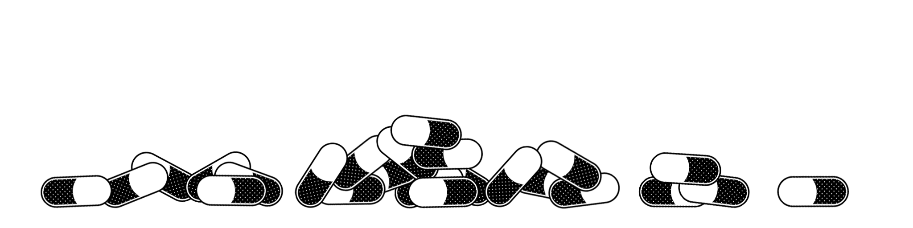

  

Data-driven game engine written in Rust

## Design Goals
- Simple
- Fast
- Extensible

## Features
- Entity Component System 
- 3D graphics (Blinn-Phong shading model, instancing)
- Scenes
- Input handling
- Sound playing
- Resource system (Mesh, Texture, Material, Sound)
- Material system
- Error chaining
- Custom components and resources support
- Launcher tool

## Getting Started
1. Install Rust  
https://www.rust-lang.org/tools/install
2. Download and unpack this repository
3. Build Pill Launcher  
`cargo build --release --manifest-path <ENGINE-PATH>\Pill-Engine\crates\pill_launcher\Cargo.toml`
4. Add Pill Launcher to PATH (optional)  
`set PATH=%PATH%;<ENGINE-PATH>\Pill-Engine\crates\pill_launcher\target\release`
5. Create new game project  
`PillLauncher.exe -a create -n Hello-Pill`
6. Run it!  
`PillLauncher.exe -a run -p ./Hello-Pill`

Check [demo](examples/Floating-Pills "demo")!

## Documentation
- For game developers - [docs](https://raw.githack.com/MattSzymonski/Pill-Engine-Docs/main/docs/game_dev/doc/pill_engine/game/index.html "Docs")  
- For engine developers - [docs](https://raw.githack.com/MattSzymonski/Pill-Engine-Docs/main/docs/engine_dev/doc/pill_engine/index.html "Docs")  
[Repository](https://github.com/MattSzymonski/Pill-Engine-Docs "Repository")

  

