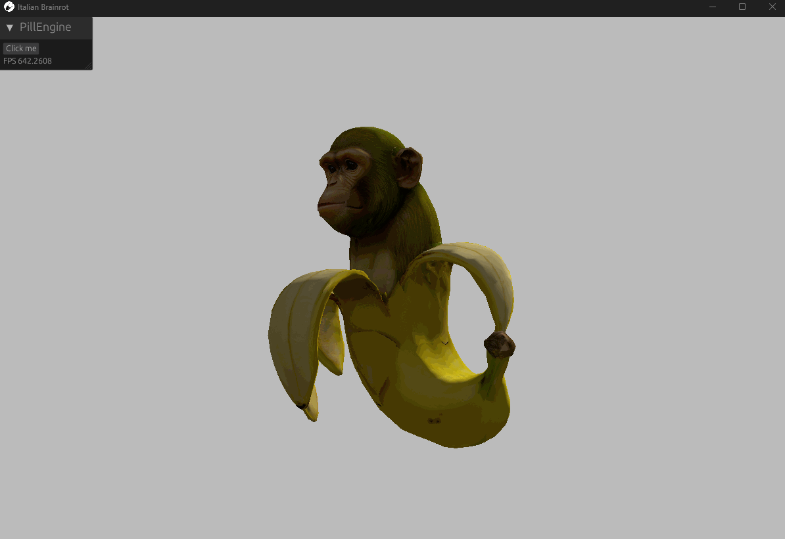

# Italian Brainrot
Simple demo displaying a rotating Chimpanzini Bananini which is a combination of chimpanzee and banana  

## Getting Started
1. [Install Pill Engine](https://github.com/MattSzymonski/Pill-Engine#getting-started "Install Pill Engine")!
2. Run demo  
`PillLauncher.exe -a run -p <ENGINE-PATH>\Pill-Engine\examples\Italian-Brainrot`

## Controls
There are none

## Showcase

  

## Attributions
Chimpanzini Bananini 3D model by: https://sketchfab.com/Aizenx.